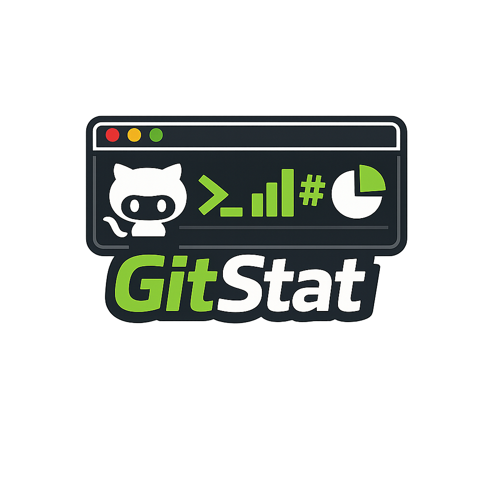

<p align='center'>
  
</p>

<h1 align='center'>📺 Github Stats Terminal </h1>
<p align='center'><strong>Transform your GitHub Profile or Repository Readme into a dynamic, premium animated terminal simulator.</strong></p>

<p align="center">
  
  
</p>

<p align='center'>
  
</p>

This engine compiles high-fidelity **interactive SVGs** featuring a professional terminal interface layout. It simulates a **real-time character-by-character typing execution** using pure CSS keyframes, bringing your profile repository to life with dynamic telemetry stats and modern aesthetic themes.

This project runs two ways: **locally via CLI** (writes a static SVG you commit yourself) or **as your own Vercel serverless API** (generates the SVG on demand). There is no GitHub Actions integration — keeping the project's surface area small and easy to self-host.

---

## 🎮 Visual Configurator Playground

Want to design your terminal card interactively? Run the project locally (see below) and open the **Visual Web Configurator** in your browser to custom-build your card.

> - Clean light-by-default UI (with a one-click dark mode toggle) built around a modern developer-tool design system.
> - **Multi-language:** switch between 9 languages (English, Español, Português, Français, Deutsch, Русский, हिन्दी, 中文, 日本語) from the header — persisted across visits.
> - Subtle interaction sounds (synthesized via [cuelume](https://www.npmjs.com/package/cuelume), no audio files) with a mute toggle, plus Apple-HIG-inspired motion (spring-like easing, respects `prefers-reduced-motion`).
> - **Interactive Command Reordering:** rearrange your execution sequence (Move ▲ / Move ▼).
> - **Custom Command Builder:** Map your own custom statements (e.g. `cat bio.txt` ➔ `Full Stack Dev @ Google`) and view live SVG compilation.
> - **Single-Click Exports:** Instantly copy your responsive `config.json` or pre-encoded Markdown code block.
> - **Instant preview:** the live preview shows a pre-generated card immediately on load (no spinner) and only calls the API once you actually change a setting.

---

## 💻 Local Setup & Usage

### 1. Prerequisites

- [Node.js](https://nodejs.org/) (v18 or higher recommended)
- [npm](https://www.npmjs.com/) package manager

### 2. Installation & Compilation

```bash
git clone https://github.com/GermanAndresLopez/terminal-readme-github-stats.git
cd terminal-readme-github-stats
npm install
```

Build the TypeScript files:

- **One-time compilation:** `npm run build` (compiles source into `/dist`)
- **CLI Dev Watcher:** `npm run dev:cli` (automatically watches files and rebuilds via `nodemon`)

### 3. Running the CLI

```bash
# Optional: set a GitHub Personal Access Token for a higher rate limit (5,000/hour instead of 60/hour)
export GHT="your_classic_github_token_here"

# Profile Mode: Compile overall user profile stats
npx ts-node bin/github-stats-terminal.ts --user GermanAndresLopez

# Repository Mode: Compile individual repository statistics
npx ts-node bin/github-stats-terminal.ts --repo owner/repository-name

# Bulk Config Mode: Process all configs in terminalConfigs/ into terminals/
npx ts-node bin/github-stats-terminal.ts --bulk
```

`GHT` (or `GITHUB_TOKEN`) is optional — without it, requests to the GitHub API are just unauthenticated and rate-limited to 60/hour.

Each run writes a static `.svg` file you commit to your own repository/README manually.

### 4. Running the Serverless API Locally

```bash
# 1. Install the Vercel CLI globally
npm i -g vercel

# 2. Fire up the local dev server
vercel dev
```

Open **`http://localhost:3000`** in your browser. This serves both the Visual Configurator (`index.html`) and the serverless API (`api/stats.ts`), with live reload on changes.

To preview a card without a GitHub token, hit the API with `mock=true`:
```
http://localhost:3000/api/stats?username=GermanAndresLopez&theme=tokyonight&mock=true
```

---

## ☁️ Deploying Your Own Vercel Instance

Once you're happy with local testing, deploy your own instance so you can embed a live, always-current SVG in any README:

```bash
vercel login
vercel --prod
```

Vercel gives you a production domain (e.g. `https://your-project.vercel.app`). Embed it in any README:

```markdown
[](https://github.com/GermanAndresLopez)
```

> [!TIP]
> **Supported query parameters:**
>
> - `username`: Your GitHub account name.
> - `theme`: Theme styling (see the [Visual Themes](#-visual-themes) table below), or `custom` combined with `customTheme`.
> - `headerStyle`: Window chrome style — `mac`, `windows`, `windows11`, `ubuntu`, `vscode`, or `retro` (borderless).
> - `hostname`: Change the CLI prompt hostname (e.g. `hostname=dev.io`).
> - `typingSpeed`: Typing latency in milliseconds per character (default: `80`).
> - `sourceType` / `target`: Set `sourceType=repo&target=owner/repo` to render repository stats instead of a user profile.
> - `customTheme`: URL-encoded JSON with your own colors, used when `theme=custom` (e.g. `{"background":"#0d1117","foreground":"#c9d1d9","accent":"#58a6ff","cursor":"#58a6ff"}`). Any field you omit falls back to the Dracula base palette.
> - `art`: The ASCII-art logo shown next to `neofetch` — one of `github`, `linux`, `arch`, `debian`, `windows`, `apple`, `xbox`, `playstation`, `avatar` (your real profile picture as ASCII art), or `photo` (your real profile picture as an actual image badge).

For the full walkthrough (environment variables, custom commands via URL, etc.), see the [Vercel Deployment Guide](docs/vercel-deployment.md).

By default, unauthenticated requests to the GitHub API are rate-limited to 60 requests/hour. Set a `GHT` (or `GITHUB_TOKEN`) environment variable in your Vercel project settings to raise that to 5,000/hour.

---

## 🐚 Configuration & Customized Commands

Customize your layout prompts and command behaviors by configuring a `.github-stats-config.json` inside your repository root (used by the local CLI), or via the equivalent query parameters on the Vercel API:

| Property         | Type       | Description                                                                          | Default                                                              |
| :--------------- | :--------- | :----------------------------------------------------------------------------------- | :------------------------------------------------------------------- |
| `sourceType`     | `string`   | Data ingestion type: `"user"` (GitHub profile stats) or `"repo"` (repository stats). | `"user"`                                                             |
| `target`         | `string`   | Target profile username or `owner/repo` path.                                        | _username_                                                           |
| `theme`          | `string`   | Visual terminal theme (see table below), or `"custom"`.                              | `"dracula"`                                                          |
| `headerStyle`    | `string`   | Window chrome style: `mac`, `windows`, `windows11`, `ubuntu`, `vscode`, or `retro`.  | `"mac"`                                                              |
| `hostname`       | `string`   | CLI prompt hostname (e.g. `user@hostname`).                                          | `"github.com"`                                                       |
| `typingSpeed`    | `number`   | Time in milliseconds per simulated keystroke.                                        | `80`                                                                 |
| `commands`       | `string[]` | Ordered list of commands to run (see supported command list below).                  | `["whoami", "neofetch", "languages", "top-repos", "uptime", "exit"]` |
| `customCommands` | `object`   | Key-value pairs mapping custom CLI strings to mock faked text outputs.               | `{}`                                                                 |
| `customTheme`    | `object`   | Custom color overrides (`background`, `foreground`, `accent`, `cursor`) used when `theme` is `"custom"`. | _(none)_                                              |
| `art`            | `string`   | ASCII-art logo for `neofetch` (see [Neofetch ASCII Art](#-neofetch-ascii-art) below), or `"avatar"`.       | `"github"`                                            |

### Supported Terminal Commands

- **`whoami`**: Prints the full user profile name or repository workspace namespace.
- **`neofetch`**: Displays a custom NeoFetch-style statistics layout alongside a retro GitHub ASCII logo.
- **`languages`**: Renders a beautiful horizontal progress bar breaking down top used languages.
- **`git-log`**: _(Repository mode only)_ Renders the 5 most recent commits with styled Git SHA hashes and commit messages.
- **`top-repos`**: _(User profile mode only)_ Renders a structured ASCII table showing your top 5 starred repositories.
- **`ps`**: Renders a active Linux process monitor mapping repositories as system processes.
- **`uptime`**: Calculates active account or repository lifespan in years and days since creation.
- **`exit`**: Simulates graceful shell terminal session exit.
- **Custom Commands**: Any custom string (e.g. `cat bio.txt`) that maps to a custom text response defined inside `customCommands`.

---

## 🎨 Visual Themes

| Theme Name              | Background | Foreground | Accent    |
| :---------------------- | :--------- | :--------- | :-------- |
| 💜 **dracula**          | `#282a36`  | `#f8f8f2`  | `#bd93f9` |
| 🌌 **tokyonight**       | `#1a1b26`  | `#a9b1d6`  | `#7aa2f7` |
| 🐱 **catppuccin**       | `#24273a`  | `#cad3f5`  | `#c6a0f6` |
| ❄️ **nord**             | `#2e3440`  | `#d8dee9`  | `#88c0d0` |
| 🍂 **gruvbox**          | `#282828`  | `#ebdbb2`  | `#fe8019` |
| 🍊 **monokai**          | `#272822`  | `#f8f8f2`  | `#f92672` |
| 🌿 **hacker**           | `#000000`  | `#00ff00`  | `#00ff00` |
| 💻 **powershell**       | `#012456`  | `#cccccc`  | `#17b2ff` |
| 🦊 **ubuntu**           | `#300a24`  | `#eeeeec`  | `#df4b1f` |
| 🤍 **github**           | `#ffffff`  | `#24292e`  | `#0366d6` |
| ⚛️ **atom**             | `#282c34`  | `#abb2bf`  | `#61afef` |
| 🌊 **solarizeddark**    | `#002b36`  | `#839496`  | `#268bd2` |
| ☀️ **solarizedlight**   | `#fdf6e3`  | `#657b83`  | `#268bd2` |
| 🎨 **material**         | `#263238`  | `#eeffff`  | `#82aaff` |
| 🦉 **nightowl**         | `#011627`  | `#d6deeb`  | `#82aaff` |
| 🔷 **cobalt2**          | `#193549`  | `#ffffff`  | `#1460d2` |
| 📄 **onelight**         | `#fafafa`  | `#383a42`  | `#0184bc` |
| 🖌️ **custom**           | _your pick_ | _your pick_ | _your pick_ |

Pick `custom` and provide `customTheme` (see the [Configuration table](#-configuration--customized-commands) above) to use your own background, foreground, accent, and cursor colors instead of a preset — the Visual Configurator has color pickers for this built in.

---

## 🪟 Window Styles

The `headerStyle` option controls the window chrome drawn around the terminal:

| Value | Description |
| :--- | :--- |
| `mac` | Classic macOS traffic-light dots (red/yellow/green). |
| `windows` | Windows "Command Prompt" title bar with accent-colored control icons. |
| `windows-static` | Same Command Prompt bar, but flat/monochrome — no color accents. |
| `windows11` | Flat, modern Windows Terminal-style bar with an accent-colored close icon. |
| `ubuntu` | GNOME/Ubuntu-style header — centered title, menu icon, single close button. |
| `vscode` | Editor-panel style — accent-colored top border and a "TERMINAL" tab label. |
| `word` | Microsoft Word-styled title bar (blue accent + "W" app icon). |
| `powerpoint` | Microsoft PowerPoint-styled title bar (orange accent + "P" app icon). |
| `linkedin` | LinkedIn-styled browser tab (blue accent + "in" mark). |
| `chrome` | Google Chrome-styled browser tab (four-color dot + "New Tab"). |
| `slack` | Slack-styled channel header (`#general` + brand-colored dots). |
| `retro` | No window chrome at all (borderless). |

---

## 🖼️ Neofetch ASCII Art

The `art` option controls the ASCII-art logo shown next to the `neofetch` command's output:

| Value | Description |
| :--- | :--- |
| `github` | The default Octocat-style blob (used if `art` is omitted or unrecognized). |
| `linux` | A simplified Tux the penguin. |
| `arch` | Arch Linux's mountain/"A" logo. |
| `debian` | A stylized swirl. |
| `windows` | The classic four-pane flag. |
| `apple` | A bitten-apple silhouette. |
| `xbox` | A bold diagonal "X". |
| `playstation` | The four PlayStation face-button glyphs (▲ ■ ● ✕). |
| `avatar` | **Converts your real GitHub profile picture into ASCII art** and uses it as the logo. Only available in user-profile mode (`sourceType=user`); if the avatar can't be downloaded/decoded, it silently falls back to `github`. |
| `photo` | Embeds your **real GitHub profile picture as an actual image** (not ASCII) — a circular badge overlaid on the card. Only available in user-profile mode; falls back to a plain card (no badge) if the photo can't be downloaded. |

```markdown
[](https://github.com/GermanAndresLopez)
```

---

## 🤝 Contributing

Contributions are welcome! If you want to submit a new theme, fix a layout bug, or add a new built-in command:

1. Fork the project.
2. Create a feature branch (`git checkout -b feature/CoolAccent`).
3. Commit your modifications.
4. Open a dynamic Pull Request!

---

## 📄 License

This project is licensed under the [MIT License](LICENSE).

## 🕘 Novedades de esta versión

Partiendo de la base original, este proyecto ha sido ampliamente rediseñado y ampliado. Los cambios más significativos hasta ahora:

- **Configurador visual rediseñado por completo** (`index.html`): nueva arquitectura de layout (rail de iconos + panel de vista previa fija), sistema de diseño propio con tokens de color/tipografía/sombra, y tema claro/oscuro conmutable.
- **Internacionalización real:** 9 idiomas (inglés, español, portugués, francés, alemán, ruso, hindi, chino, japonés) con banderas y persistencia de preferencia.
- **Sonido de interfaz sintetizado** vía [cuelume](https://www.npmjs.com/package/cuelume) (sin archivos de audio), con control de silencio.
- **Foto de perfil real de GitHub como opción principal** del `art` de `neofetch` (antes era el logo genérico de Octocat).
- **Vista previa en vivo instantánea:** al cargar la página se muestra de inmediato una tarjeta pregenerada (sin loader); la API solo se llama cuando el usuario cambia algo.
- **Separación de endpoints** `api/resolve` (consulta a GitHub, cacheada) y `api/render` (renderizado desde caché) para no gastar cuota de la API de GitHub en cada ajuste del configurador.
- **Botón "Star on GitHub"** en la cabecera con conteo de estrellas en vivo.

## Créditos

Este proyecto está basado en **[github-stats-terminal-style](https://github.com/yogeshwaran01/github-stats-terminal-style)**, creado por **Yogeshwaran R** y distribuido bajo la licencia MIT.

A partir de esa base, el proyecto ha sido ampliamente rediseñado y ampliado con una nueva arquitectura, nuevas funcionalidades, mejoras de rendimiento, mayor capacidad de personalización y una experiencia de usuario significativamente superior.

Ver [LINEAMIENTOS.md](LINEAMIENTOS.md) para más detalle sobre esta relación y la estrategia del proyecto.
